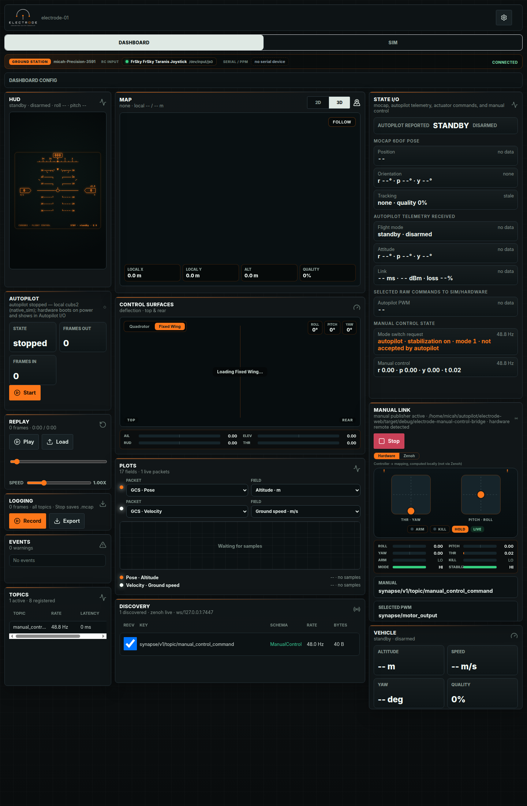
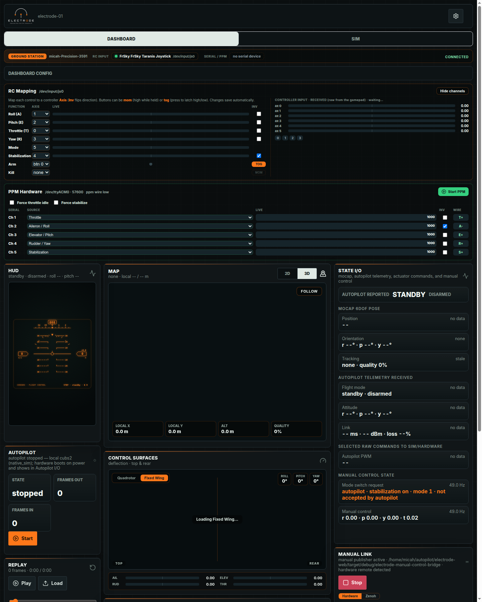
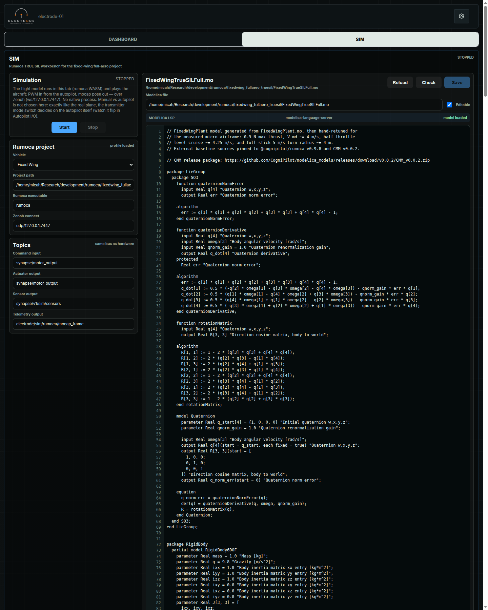

# Using The UI

This page is a tour of Electrode in full Ground Station mode. Ground Station
mode is active when the app is served by `electrode-ground-station` and the
same-origin `gcs/*` APIs are available. That unlocks hardware status, RC
mapping, PPM output, autopilot control, and simulation workbench panels.



## From A Fresh Clone

From the repository root:

```sh
npm ci
npm run station
```

`npm run station` builds the web app, starts the Rust Ground Station daemon,
serves the UI, and enables the local `gcs/*` hardware APIs. When it is ready,
open:

```text
http://127.0.0.1:8790/
```

Use that local URL for simulation, RC mapping, PPM, and autopilot workflows.
The static GitHub Pages viewer and the Vite dev server can display telemetry,
but they cannot start local native tools or access host hardware.

## First Read

Use the screen from top left to bottom right:

1. Check the header for the active vehicle id and the theme/settings menu.
2. Check the Ground Station strip for backend host, RC input, serial/PPM, and
   connection status.
3. Check **State I/O** for whether expected Synapse topics are arriving.
4. Use **HUD**, **Map**, and **Vehicle** for quick flight-state awareness.
5. Use **Manual Link** and **Control Surfaces** to verify operator input and
   selected actuator output.
6. Use **Plots**, **Discovery**, **Topics**, **Replay**, and **Logging** when
   debugging or recording a session.

## Header

The header shows the Electrode mark, the current vehicle id, and the settings
menu. The settings menu currently contains the light/dark theme toggle.

If the vehicle id is not the vehicle you expect, confirm the app was opened
with the intended backend or Zenoh stream source.

## Ground Station Strip

The strip below the Dashboard/SIM tabs is the backend capability summary. It
reports:

- The host serving `electrode-ground-station`.
- The detected RC input device.
- The serial/PPM device state.
- Whether the browser is connected to the local backend.

If the strip is missing, you are in static Viewer mode. Open the app through
the local daemon, usually `http://127.0.0.1:8790/`, instead of a static build or
GitHub Pages URL.

## Dashboard Config

Open **Dashboard Config** when you need to adjust physical controls or output
hardware.



### RC Mapping

**RC Mapping** maps the controller axes and buttons into Electrode's manual
control model. Use the live controller input bars on the right to identify
which axis moves when you move a stick.

- **Axis** chooses the raw controller axis.
- **Inv** flips an axis direction.
- **MOM** means momentary, active only while held.
- **TOG** means toggle/latch.

Changes save through the Ground Station backend and are reflected immediately
in **Manual Link**.

### PPM Hardware

**PPM Hardware** maps logical control sources to serial PPM output channels.
Use it when Electrode is driving an external receiver or encoder.

- The channel rows define throttle, roll, pitch, yaw, and stabilization output.
- **Force throttle idle** and **Force stabilize** are safety overrides.
- **Start PPM** starts the native PPM bridge when a serial device is available.

Use the live values to confirm channel order before connecting anything that
can move actuators.

For hardware-in-the-loop work, the autopilot can be a real flight-control board
or the local `cubs2` native simulation. The PPM bridge does not run the
autopilot; it selects between manual-control output and autopilot PWM output,
then writes the selected PPM packet to the serial encoder/receiver hardware.
Start the autopilot path first, verify **Selected raw commands to
sim/hardware**, then start PPM output.

## HUD

The **HUD** is the quickest attitude readout. It summarizes standby/arming,
roll, and pitch in the panel subtitle, then renders a flight-display style view
with heading, pitch ladder, roll marker, speed, and altitude.

When telemetry is missing, the subtitle shows `--` values. Treat that as a data
path problem before debugging the visualization itself.

## Map

The **Map** panel is the position view. The `2D`/`3D` switch changes between a
flat mission-style map and the local 3D scene. `Follow` recenters the view on
the vehicle.

The bottom chips show local X, local Y, altitude, and localization quality.
If quality is `0%` or the subtitle says `no fix`, check mocap/GNSS/local-pose
topics in **State I/O** and **Discovery**.

## State I/O

**State I/O** is the data-contract panel. It groups the key flows Electrode
expects:

- **Autopilot reported**: vehicle mode and arming status.
- **Mocap 6DOF pose**: position, orientation, and tracking freshness.
- **Autopilot telemetry received**: flight mode, attitude, and link data.
- **Selected raw commands to sim/hardware**: actuator/PWM command stream.
- **Manual control state**: mode-switch request and manual-control values.

Use this panel first when a downstream panel looks wrong. If State I/O says
`no data` or `stale`, the UI is faithfully reporting that the topic has not
arrived or has timed out.

In Ground Station mode, the manual-control rows can update even without vehicle
telemetry because the backend can publish local joystick state.

## Replay

**Replay** loads MCAP recordings and feeds them through the same worker/state
pipeline used by live data. Use the play/pause button, load button, timeline,
and speed slider to inspect previous sessions.

Replay is useful for UI work because it lets you reproduce a vehicle state
without hardware.

## Logging

**Logging** records live topics into MCAP. Press **Record** before the event you
want to capture, press it again to stop, then **Export** to download the file.

The counter reports how many frames are buffered. A stopped recording is what
saves the `.mcap` export cleanly.

## Events

**Events** is the short operational log. Warnings and errors appear here when
the state store or bridge observes something the operator should notice.

If the UI looks quiet but behavior feels wrong, check this panel before opening
developer tools.

## Topics

**Topics** lists active registered topic snapshots with rate and latency. It is
a compact way to see whether Electrode knows about a stream, how fast it is
arriving, and whether it is late.

In Viewer mode with no backend or Zenoh stream, this panel is expected to say
`No topics`.

## Control Surfaces

**Control Surfaces** visualizes the currently selected command output as
aircraft deflections. Switch between **Quadrotor** and **Fixed Wing** to match
the vehicle model you are inspecting.

Use this beside **Manual Link**: Manual Link shows operator intent, while
Control Surfaces shows what that intent or selected autopilot output becomes.

## Plots

**Plots** graphs selected fields from live or replayed packets. Choose a packet
and field for each trace, then watch the plot and legend for last values and
ranges.

Start with altitude and ground speed when checking whether replay/live decoding
is working. Add attitude, link, or control fields once the basic stream is
healthy.

## Discovery

**Discovery** shows raw observed Zenoh keys, schemas, rates, and byte counts.
Use it when a stream exists but Electrode is not decoding it into a higher-level
panel.

The usual debugging sequence is:

1. Confirm the key appears in Discovery.
2. Confirm the schema/bytes look plausible.
3. Confirm the matching State I/O row is fresh.
4. Then inspect the visual panel that consumes that state.

## Manual Link

**Manual Link** displays controller sticks, arm/kill state, signal state, axis
values, and the manual-control topic it is waiting for.

In Ground Station mode, the **Hardware** tab shows locally computed joystick
state before it leaves the machine. The **Zenoh** tab shows the actual
`manual` stream after publication. Compare
them when debugging mapping, transport, or stale-command behavior.

When no RC controller is plugged in and the native manual publisher is stopped,
Electrode enables a keyboard fallback. The Manual Link subtitle says
`keyboard remote active` when this path is live.

Keyboard controls:

- Arrow left/right: roll.
- Arrow up/down: pitch.
- `A` / `D`: yaw.
- `W` / `S`: throttle up/down.
- `M`: toggle manual/autopilot mode request.
- `T`: toggle stabilization active.

The keyboard path is meant for bench testing and simulation bring-up, not for
flying hardware.

## Vehicle

**Vehicle** is the compact summary: altitude, speed, yaw, and quality. It is
the panel to glance at when the larger HUD/Map panels are off screen.

If **Vehicle** disagrees with **HUD** or **Map**, prefer **State I/O** as the
source of truth and check whether one of the panels is using stale data.

## Sim Bring-Up

Use this sequence when you want the browser plant, local autopilot, manual
input, and Ground Station display all working together.

### 1. Open The Full Ground Station

Start the app through the Ground Station command if it is not already running:

```sh
npm run station
```

Then open the local daemon URL:

```text
http://127.0.0.1:8790/
```

Confirm the Ground Station strip says **Connected**. Also check the same strip
for the RC input device and serial/PPM status. If the Ground Station strip is
missing, you are in static Viewer mode and cannot start the local autopilot or
simulation from the UI.

### 2. Check The Dashboard Config

Open **Dashboard Config** before starting anything that can publish commands.

Confirm **RC Mapping** moves the expected axes when you move the sticks. If an
axis moves backward, flip **Inv** for that row. Confirm the mode switch row
changes when you move the controller mode switch.

Confirm **PPM Hardware** only if you are using serial PPM output. For pure
simulation, PPM hardware can stay stopped.

### 3. Start Manual Publishing

If an RC controller is attached, press **Start** in **Manual Link** when the
manual publisher is stopped. The panel should show **Hardware** as live and the
`manual` (ManualControlCommand) topic.

If no RC controller is attached, leave the native manual publisher stopped and
use the keyboard fallback. The panel should say `keyboard remote active`.

Then check **State I/O -> Manual control state**. It should show fresh data at
roughly controller rate. If it says `waiting for manual control`, fix
manual publishing before starting the sim.

### 4. Put The Mode Switch In The Intended Mode

The sim does not choose manual or autopilot mode. It behaves like the aircraft:
the transmitter mode switch sends `manual.flight_mode`, and the
autopilot decides whether to accept that mode.

Use these checks:

- Manual mode: **State I/O -> Mode switch request** should read `manual` or
  mode `0`.
- Autopilot mode: **State I/O -> Mode switch request** should read `autopilot`
  or mode `1+`.
- Accepted autopilot mode: **Autopilot reported** should change to `auto`.
- Mismatch: if **Mode switch request** says `autopilot ... not accepted by
  autopilot`, the switch request is reaching Electrode but the autopilot has
  not accepted that mode yet.

For a closed-loop sim test, put the switch in autopilot mode and wait for
**Autopilot reported** to show `auto`. For a manual plant test, leave the
switch in manual mode and verify **Control Surfaces** responds to stick input.

### 5. Start The Autopilot

On the Dashboard, find **Autopilot** and press **Start**. The panel should move
from `stopped` to `running · pid ...`.

For the default local workflow this starts the `cubs2` native simulation. For
PPM or hardware-in-the-loop workflows, the autopilot may instead be a real
flight-control board that boots on power; in that case use **State I/O** and
**Autopilot reported** to verify it is producing telemetry before enabling PPM
output.

Watch **Frames out** and **Frames in**:

- **Frames out** means Electrode is forwarding commands/sensor data toward the
  autopilot link.
- **Frames in** means the autopilot is sending data back.

If the process starts but frame counts stay at zero, check the Zenoh endpoint
and the autopilot profile before debugging the UI.

### 6. Start The SIM Tab

Open **SIM** and press **Start** in the Simulation panel. Leave the topic names
at their defaults unless you intentionally changed the rest of the stack.

After the sim starts, return to **Dashboard** and check:

- **Discovery** should show new sim/autopilot topics.
- **State I/O -> Mocap 6DOF pose** should become fresh.
- **State I/O -> Autopilot telemetry received** should become fresh.
- **Map** and **HUD** should stop showing only placeholder values once state is
  flowing.

### 7. Verify The Control Path

Use the panels together:

1. **Manual Link**: confirms local joystick and published manual-control state.
2. **State I/O**: confirms the requested mode and whether the autopilot accepts
   it.
3. **Selected raw commands to sim/hardware**: confirms the command stream that
   the plant receives.
4. **Control Surfaces**: visualizes the selected output.
5. **Plots**: graph altitude, ground speed, attitude, or control fields once
   samples are flowing.

### 8. Shut Down In Reverse

Stop the sim first, then stop the autopilot, then stop manual publishing if you
are done with the controller. Export any logs before closing the tab.

## SIM

The **SIM** tab is the Rumoca TRUE SIL workbench. It runs the flight model in
the browser tab with Rumoca WASM and uses the same Zenoh topic contract as the
hardware path.



Use the left column to choose the vehicle kind, Rumoca project path, executable,
Zenoh endpoint, and topic names. Use **Start** and **Stop** to control the
in-browser plant.

Use the editor on the right to inspect or edit the Modelica file. **Reload**
pulls the file from disk, **Check** validates the configured model, and **Save**
writes changes when the file is editable.

Simulation publishes mocap-like pose output and consumes the selected actuator
command stream, so it is most useful when checking the whole command path:

1. Start manual publishing.
2. Put the mode switch in the intended mode.
3. Start the autopilot.
4. Start the sim.
5. Confirm the command, sensor, and telemetry topics in **Discovery**.
6. Confirm **State I/O** receives fresh mocap and telemetry.
7. Use **HUD**, **Map**, **Plots**, and **Manual Link** to inspect behavior.

## Static Viewer Mode

Static Viewer mode is what the same app shows when no local Ground Station
daemon answers `gcs/health`. Hardware panels, Dashboard Config, and SIM are not
available, but live Zenoh-over-WebSocket, replay, logging, plots, discovery,
and visualization still work.


Use `?viewer` to force this mode even when the app is served by the daemon.
